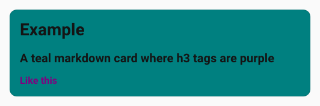

# Navigation dans le DOM

Home Assistant utilise largement le [DOM fantôme](https://developer.mozilla.org/en-US/docs/Web/Web_Components/Using_shadow_DOM). Il facilite la réutilisation de composants comme `<ha-card>` ou `<ha-icon>`, mais nécessite des techniques particulières pour appliquer des styles CSS aux éléments.

En examinant une carte dans l'inspecteur d'éléments de votre navigateur, vous avez peut-être vu une ligne comme `#shadow-root (open)` (son libellé exact dépend du navigateur). Les éléments qui se trouvent à l'intérieur n'héritent pas des styles extérieurs.

Pour styliser les éléments d'un `#shadow-root`, définissez `style:` sous forme de dictionnaire plutôt que de chaîne.

Pour chaque entrée du dictionnaire, la clé sélectionne un ou plusieurs éléments à l'aide d'une fonction [`querySelector()`](https://developer.mozilla.org/en-US/docs/Web/API/Document/querySelector) modifiée. La valeur de l'entrée est ensuite injectée dans ces éléments.

::: tip
La fonction `querySelector()` modifiée remplace le signe dollar `$` par un `#shadow-root` dans le sélecteur.

:::
Le processus est récursif : la valeur peut donc aussi être un dictionnaire. La clé `.` (un point) sélectionne l'élément actuel.

::: example
Modifions la couleur des titres de troisième niveau (`### comme ceci`) dans une carte Markdown, ainsi que l'arrière-plan de la carte.
```yaml
type: markdown
content: |-
    # Example
    ## A teal markdown card where h3 tags are purple
    ### Like this
```

Dans l'inspecteur d'éléments de Chrome, le HTML ressemble à l'image ci-dessous.

    
    

L'élément `<ha-card>` est la base. Pour atteindre `<h3>`, il faut traverser un `#shadow-root`, situé dans l'élément `<ha-markdown>`. Le sélecteur est donc :
```yaml
  ha-markdown $:
```
Il trouve le premier élément `<ha-markdown>`, puis tous les `#shadow-root` qu'il contient.

Pour ajouter un arrière-plan à `<ha-card>`, appliquons les styles directement à l'élément de base, à l'aide de la clé :

```yaml
  .:
```

On obtient le style final suivant :

```yaml
uix:
  style:
    ha-markdown$: |
      h3 {
        color: purple;
      }
    .: |
      ha-card {
        background: teal;
      }
```



:::
La chaîne de sélecteurs recherche les éléments un par un, séparés par des espaces ou par `$`. À chaque étape, seul le premier résultat est retenu. En revanche, le dernier sélecteur de la chaîne (c'est-à-dire la clé d'une entrée du dictionnaire) sélectionne **tous** les éléments correspondants.

Une chaîne terminée par `$` constitue un raccourci qui sélectionne les DOM fantômes de tous les éléments.

::: example Chaining example
Le sélecteur suivant cible les éléments `div` du premier marqueur d'une carte :
```yaml
  ha-map $ ha-entity-marker $ div: |
```
Celui-ci cible les éléments `div` de tous les marqueurs de la carte : la première clé se termine par le sélecteur `ha-entity-marker $`, puis une nouvelle recherche de `div` est effectuée dans chaque résultat.
```yaml
  ha-map $ ha-entity-marker $:
    div: |
```

:::
::: warning Optimisation de l'ordre de chargement
Comme indiqué ci-dessus, les optimisations de l'ordre de chargement de Home Assistant ne garantissent pas que les éléments `ha-entity-marker` existent au moment où UIX les recherche.

Si vous divisez encore la chaîne :
```yaml
  ha-map $:
    ha-entity-marker $:
      div: |
```
UIX pourra alors réessayer plus tard la recherche à partir de `ha-map $`, ce qui peut donner des résultats plus fiables.

Si le résultat est intermittent, essayez de diviser la chaîne en plusieurs étapes.

:::
## Sélecteur de recherche rapide `$$`

Pour les éléments profondément imbriqués — notamment les fonctionnalités de carte et les commandes de la fenêtre « Plus d'informations » — décrire tous les passages intermédiaires dans les DOM fantômes peut être verbeux. Le **sélecteur de recherche rapide** `$$` est une notation abrégée : il effectue une **recherche récursive traversant les DOM fantômes** parmi tous les descendants du contexte actuel, quel que soit le nombre de limites rencontrées.

```
A $$ B $
```

est équivalent à :

```
A $ <intermediate-1> $ <intermediate-2> $ … B $
```

Les passages intermédiaires entre les hôtes des DOM fantômes sont résolus automatiquement.

::: tip
`$$` est un **sélecteur intermédiaire** : il doit toujours se trouver entre deux étapes, jamais au début d'un chemin.

:::
::: example Fonctionnalités de carte — avant et après
Chemin explicite détaillé :
```yaml
uix:
  style:
    hui-card-features $:
      hui-card-feature $:
        hui-humidifier-toggle-card-feature $:
          ha-control-select $: |
            .container {
              opacity: 0.8;
            }
```
Avec `$$` :
```yaml
uix:
  style:
    "hui-card-features $$ ha-control-select $": |
      .container {
        opacity: 0.8;
      }
```

:::
::: example Multiple card feature types
```yaml
uix:
  style:
    "hui-card-features $$ ha-control-number-buttons $": |
      #input::before {
        background: red;
      }
    "hui-card-features $$ ha-control-select-menu $": |
      .select-anchor {
        --control-select-menu-background-color: red !important;
      }
      .select-anchor:hover {
        --control-select-menu-background-color: purple !important;
      }
```

:::
::: warning Performance
Comme `$$` parcourt tout le sous-arbre du DOM fantôme du contexte actuel, il est nécessairement plus lent qu'un chemin explicite. Pour les cas où les performances sont importantes, préférez le chemin explicite.

:::
::: warning Load order and retries
Le mécanisme de nouvelle tentative qui stabilise l'ordre de chargement des chemins `$` en séparant la chaîne sur plusieurs niveaux de dictionnaire s'applique à chaque entrée. Avec le sélecteur rapide `$$`, toute la recherche profonde est relancée en une seule fois. Si l'élément cible est chargé très tard, séparez le chemin explicite sur deux niveaux de dictionnaire :
```yaml
uix:
  style:
    hui-card-features $:
      "hui-card-feature $$ ha-control-select $": |
        .container { opacity: 0.8; }
```
UIX peut ainsi réessayer séparément à partir de `hui-card-features $`.

:::
## Sélection de chemin hôte/élément

Un chemin peut commencer par `&`, un sélecteur **hôte/élément** placé en première étape. Il filtre l'élément initial auquel UIX s'applique avant tout parcours :

- Si l'élément initial est un **ShadowRoot**, le filtre s'applique à son élément **hôte**.
- Si l'élément initial est un **Element** ordinaire, le filtre s'applique directement à cet élément.

En général, utilisez le sélecteur de chemin hôte/élément dans un thème pour appliquer un chemin lorsque l'hôte ou l'élément possède une classe, un identifiant ou un attribut précis.

La correspondance examine directement les propriétés du parent ou de l'hôte, sans moteur de sélecteurs CSS, car c'est l'hôte ou l'élément lui-même qui est filtré. Les jetons suivants sont pris en charge ; tous les jetons indiqués doivent correspondre :

| Jeton | Vérification |
|-------|--------|
| `tagname` | `element.localName === 'tagname'` |
| `.classname` | `element.classList.contains('classname')` |
| `#id` | `element.id === 'id'` |
| `[attr]` | `element.hasAttribute('attr')` |
| `[attr=val]` | correspondance exacte de la valeur |
| `[attr^=val]` | la valeur commence par |
| `[attr$=val]` | la valeur se termine par |
| `[attr*=val]` | la valeur contient |
| `[attr~=val]` | mot correspondant dans une liste séparée par des espaces |
| `[attr\|=val]` | valeur égale ou sous-balise précédée de `-` |
| `{.prop}` | `element.prop` is not `null`/`undefined` |
| `{!.prop}` | le chemin de propriété n'existe pas |
| `{.prop=val}` | `String(element.prop) === val` |
| `{.prop=undefined}` | `element.prop` existe et vaut strictement `undefined` |
| `{.prop^=val}` | la valeur convertie en chaîne commence par `val` |
| `{.prop$=val}` | la valeur convertie en chaîne se termine par `val` |
| `{.prop*=val}` | la valeur convertie en chaîne contient `val` |
| `{.prop~=val}` | mot correspondant dans une liste de valeurs converties en chaînes et séparées par des espaces |
| `{.prop\|=val}` | valeur égale ou sous-balise précédée de `-` |

Les jetons peuvent être combinés, par exemple `&ha-dialog.my-class[data-type="video"]`, et doivent tous correspondre. Les espaces **hors** des crochets de sélecteur d'attribut et des accolades de sélecteur de propriété séparent le chemin ; ils ne sont donc **pas** admis dans un sélecteur `&`. Les espaces et `$` contenus dans `[…]` et `{…}`, y compris dans les valeurs entre guillemets, sont considérés comme des caractères littéraux. Les opérateurs comme `$=` (se termine par) et les valeurs contenant des points ou des espaces fonctionnent donc correctement.

Les sélecteurs de propriété parcourent les propriétés JavaScript réelles de l'élément à l'aide d'un chemin séparé par des points et de l'accès conditionnel. Par exemple, `{.notification.notification_id='1234567'}` correspond à `element.notification?.notification_id`. Les segments de chemin constitués d'entiers sont traités comme des index de tableau lorsque la valeur actuelle est un `Array` : `{.items.0.name}` accède à `element.items[0].name`. Les clés nommées fonctionnent aussi sur les tableaux, car ceux-ci sont des objets JavaScript. Les valeurs peuvent être entre guillemets doubles, entre apostrophes ou sans guillemets.
La valeur non encadrée `undefined` est réservée au test explicite d'une valeur indéfinie. Pour rechercher la chaîne littérale, écrivez `'undefined'` ou `"undefined"`.
Utilisez la forme négative non encadrée `{!.prop}` pour rechercher un chemin de propriété absent. Elle ne correspond pas à une propriété existante dont la valeur est `undefined` ou `null`.

Pour plus de lisibilité, vous pouvez entourer un sélecteur de classe de parenthèses : `&(.my-class)` équivaut à `&.my-class`.

::: example Exemple : styliser une boîte de dialogue
Stylisez le contenu d'une boîte de dialogue uniquement si son type est `type-hui-dialog-web-browser-play-media` :
```yaml
uix-dialog-yaml: |
  "&(.type-hui-dialog-web-browser-play-media) $ ha-dialog-header $": |
  section.header-content {
    display: none;
  }
```
L'étape `&(.type-...)` filtre les nœuds initiaux selon la classe de leur élément hôte, puis `$` traverse le DOM fantôme.

:::
::: example Exemple : styliser un badge
Stylisez la bordure du badge de puissance totale du tableau de bord énergétique, qui possède la classe `.type-power-total`. La bordure ne peut être stylisée que dans le DOM fantôme. Le sélecteur hôte/élément `&` permet de cibler uniquement les badges portant cette classe tout en traversant le DOM fantôme.
```yaml
uix-badge-yaml: |
  .: |
    :host(.type-power-total) {
      --ha-card-border-width: 3px;
      --ha-card-border-color: red;
    }
  "&.type-power-total ha-badge $": |
    .badge {
      border-style: double !important;
    }
```

:::
::: example Exemple : sélecteurs d'attribut avec `$=` et des points
Les sélecteurs d'attribut — y compris ceux qui se terminent par (`$=`) et les valeurs contenant des points — fonctionnent correctement, car `$` et `.` dans `[…]` ne sont jamais considérés comme des séparateurs de chemin ou des jetons de classe.

Appliquez des styles au marqueur d'une entité de carte dont l'attribut `entity-id` se termine par `dev` :
```yaml
uix-entity-marker-yaml: |
  "&[entity-id$='dev']": |
    :host {
      --uix-image: /local/media/person_grey.png;
    }
    div.marker {
      border-color: red !important;
      border-width: 5px;
    }
```

Appliquez des styles au marqueur de l'entité `person.dev` (l'identifiant contient un point) :
```yaml
uix-entity-marker-yaml: |
  "&[entity-id='person.dev']": |
    :host {
      --uix-image: /local/media/person_grey.png;
    }
    div.marker {
      border-color: red !important;
      border-width: 5px;
    }
```

:::
::: example Exemple : sélecteurs de propriété `{.prop}`
Les sélecteurs de propriété lisent les véritables propriétés JavaScript de l'élément, et non ses attributs HTML. Ils s'écrivent entre accolades, avec un chemin précédé d'un point :

```yaml
uix:
  style:
    # bare presence check — passes when element.notification is not null/undefined
    "&{.notification}":
      ".": |
        ha-card { opacity: 0.5; }

    # exact match on a nested property
    "&{.notification.notification_id='1234567'}":
      ".": |
        ha-card { border: 2px solid red; }

    # starts-with operator
    "&{.type^=light}":
      ".": |
        ha-card { background: yellow; }

    # array index access — resolves element.items[0].name
    "&{.items.0.name='foo'}":
      ".": |
        ha-card { background: teal; }
```

Les mêmes opérateurs que pour les sélecteurs d'attribut sont pris en charge (`=`, `~=`, `^=`, `$=`, `*=`, `|=`). Les segments entiers servent d'index de tableau si la valeur actuelle est un `Array` ; les clés nommées (chaînes) accèdent toujours directement aux propriétés, sur les tableaux comme sur les objets ordinaires.

:::
## Outils d'inspection du DOM

UIX fournit des outils pour la console du navigateur qui facilitent la découverte des chemins de style valides, des chemins des sparks Forge, des ancres de directives Broker et de la hiérarchie des éléments UIX pendant l'exécution. Ouvrez la console des outils de développement, sélectionnez un élément dans le panneau **Éléments** (il devient `$0`), puis appelez l'une des fonctions suivantes.

### `uix_tree($0)` — outil général

Affiche les informations dont UIX dispose sur la zone autour de l'élément sélectionné :

| Section | Contenu |
| ------- | ------------- |
| **📦 Closest UIX Parent** | Élément ancêtre le plus proche auquel un `uix-node` non enfant est attaché, avec ses variables de modèle UIX (généralement `config`) et son type UIX (par exemple `card` ou `view`). |
| **👶 Active UIX Children** | Chemins actuellement stylisés comme enfants du parent UIX, avec les éléments DOM résolus. |
| **🗺️ Available YAML Selectors** | Toutes les clés de style YAML accessibles dans le sous-arbre DOM fantôme du parent UIX, jusqu'à la prochaine limite de parent UIX. Chaque clé correspond à un contexte fantôme et répertorie les sélecteurs CSS valides pour sa chaîne de style. |

```js
uix_tree($0)
```

::: example
Après avoir sélectionné une carte dans l'inspecteur et exécuté `uix_tree($0)`, la console peut afficher :

```
💡 UIX Tree 💡
  Target element: <hui-card>
  📦 Closest UIX Parent
    Element: <hui-card>
    UIX type: card
  👶 Active UIX Children: none
  🗺️ Available YAML Selectors  (2 YAML selectors, 5 CSS selectors)
    ".":  (2 CSS selectors)
      ha-card  <ha-card>
      ha-card ha-markdown  <ha-markdown>
    "ha-markdown $":  (3 CSS selectors)
      h3  <h3>
      p  <p>
      p span  <span>
```

Chaque libellé de groupe indique une clé de style YAML suivie de la syntaxe `:` requise. Les sélecteurs CSS indiqués sont valides dans la chaîne de style de cette clé. Chaque sélecteur est suivi d'une référence cliquable vers l'élément ; cliquez dessus pour le retrouver directement dans l'inspecteur.

:::
### `uix_style_path($0)` — outil de style

Indique le chemin UIX exact vers l'élément sélectionné et génère un extrait YAML prêt à coller :

| Section | What it shows |
| ------- | ------------- |
| **📦 Closest UIX Parent** | Même contenu que pour `uix_tree`. |
| **📍 UIX Path to Target** | Chemin exact (avec `$` pour traverser les DOM fantômes) entre le contexte parent UIX et `$0`. Utilisez-le comme clé dans une configuration UIX `style:`. |
| **🎨 CSS Target** | Nom de balise, identifiant, classes et sélecteur CSS suggéré pour l'élément ; chacun est suivi d'une référence cliquable qui permet de le retrouver dans l'inspecteur. |
| **📝 Boilerplate UIX YAML** | Extrait YAML de carte prêt à coller. Affiché uniquement pour les types qui acceptent une clé `uix:` au niveau de la carte. |
| **📝 Boilerplate Theme YAML** | Extrait YAML de thème prêt à coller, affiché pour tous les types. Pour les types uniquement stylisables par thème (par exemple `dialog`, `sidebar` et `view`), c'est le seul extrait fourni. Si des passages de DOM fantôme sont nécessaires, la variante `-yaml` de la variable de thème est utilisée. |

```js
uix_style_path($0)
```

`uix_path($0)` est une forme abrégée de `uix_style_path($0)`.

::: example
Après avoir sélectionné le titre `<h3>` d'une carte Markdown et exécuté `uix_style_path($0)` :

```
💡 UIX Style Path 💡
  Target element: <h3>
  📦 Closest UIX Parent
    Element: <hui-markdown-card>
    UIX type: card
  📍 UIX Path to Target
    Path: "ha-markdown $":
  🎨 CSS Target
    Tag: h3
    Suggested CSS selector: h3  <h3>
  📝 Boilerplate UIX YAML
    uix:
      style:
        "ha-markdown $": |
          h3 {
            /* your styles for h3 */
          }
  📝 Boilerplate Theme YAML
    my-awesome-theme:
      uix-theme: my-awesome-theme
      uix-card-yaml: |
        "ha-markdown $": |
          h3 {
            /* your styles for h3 */
          }
```

La ligne **Path** indique la clé YAML avec le `:` requis. Le **Suggested CSS selector** est suivi d'une référence cliquable qui affiche l'élément dans les outils de développement.

:::
### `uix_forge_path($0)` — outil Forge

Indique le chemin entre l'élément `uix-forge` le plus proche et l'élément sélectionné. Utilisez ce chemin comme valeur de `for`, `before` ou `after` dans la configuration d'un spark Forge.

| Section | Contenu |
| ------- | ------------- |
| **📦 Closest UIX Forge Parent** | Élément ancêtre `uix-forge` le plus proche. |
| **📍 Forge Path to Target** | Chemin de sélecteurs entre l'élément Forge et `$0` (avec `$` pour traverser les DOM fantômes). |
| **📝 Boilerplate Spark YAML** | Extrait YAML prêt à coller qui montre comment utiliser le chemin. |

```js
uix_forge_path($0)
```

::: warning
Si vous ajoutez un élément spark du même type — par exemple une icône de tuile **avant** `ha-tile-icon` — consultez attentivement la documentation du spark. Elle explique comment préciser le chemin pour éviter de sélectionner l'élément du spark lui-même lors des mises à jour.

:::
::: example
Après avoir sélectionné `ha-tile-icon` dans une carte Tile et exécuté `uix_forge_path($0)` :

```
📦 Closest UIX Forge Parent
  Element: <uix-forge class=​"type-custom-uix-forge">​…​</uix-forge>​
📍 Forge Path to Target
  Path: "hui-tile-card $ ha-card ha-tile-container ha-tile-icon"
  Use this path as the value of `for`, `before`, or `after` in a spark config.
📝 Boilerplate Spark YAML
forge:
  sparks:
    - type: tooltip
      for: "hui-tile-card $ ha-card ha-tile-container ha-tile-icon"
      content: "..."
    # for tile-icon / state-badge sparks:
    # - type: tile-icon
    #   before: "hui-tile-card $ ha-card ha-tile-container ha-tile-icon"
    #   icon: mdi:home
```

:::
### `uix_broker_path($0)` — outil pour les ancres de directive Broker

Après avoir déclenché une interaction Broker, sélectionnez un élément à l'intérieur
de son ancre résolue, puis exécutez :

```js
uix_broker_path($0)
```

L'outil trouve l'ancre d'interaction récente la plus précise qui contient `$0` et
affiche un chemin UIX complet relatif à cette ancre. Utilisez le résultat comme
valeur de `anchor` pour une directive `property` ou `event`. Si plusieurs
interactions actives se chevauchent, transmettez explicitement l'ancre voulue en
deuxième argument :

```js
uix_broker_path($0, $1)
```

### `uix_broker_absolute_path($0)` — outil pour les ancres d'interaction Broker

Sélectionnez un élément dans le panneau **Éléments**, puis exécutez :

```js
uix_broker_absolute_path($0)
```

La fonction affiche et renvoie un chemin UIX depuis la racine du document, préfixé
par `&` et prêt à être utilisé comme `anchor` d'interaction :

```yaml
anchor: "&home-assistant $ hui-dialog-create-card"
```
