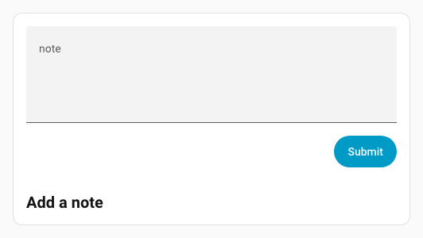
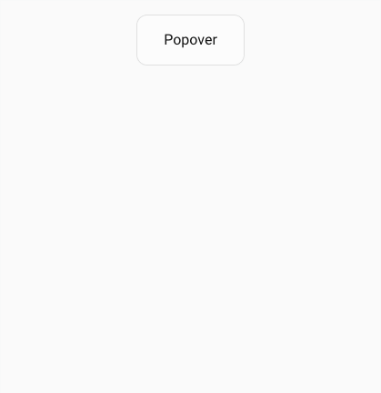

# Spark Formulaire

Le spark `form` intègre le composant Home Assistant `<ha-form>` dans un élément Forge. Son `schema` utilise le schéma standard des formulaires Home Assistant : chaque champ possède un `name` unique, éventuellement `label` et `default`, ainsi qu’un `selector` Home Assistant.

Les boutons facultatifs `submit` et `clear` exécutent des actions Home Assistant. Les valeurs actuelles sont fusionnées dans leur `data` et prennent la priorité sur les données statiques de même nom. Les boutons peuvent être omis : dans une [action Popover](../../extras/uix-actions#popover), les valeurs sont automatiquement transmises à `tap_action`, `hold_action` ou `double_tap_action` des deux boutons de pied de page.

## Utilisation de base

Une carte Forge vide ne nécessite aucun sélecteur de placement : le formulaire est automatiquement inséré dans son contenu.

```yaml
type: custom:uix-forge
forge:
  mold: card
  sparks:
    - type: form
      density: dense
      schema:
        - name: message
          label: Message
          selector:
            text: {}
        - name: priority
          label: Priority
          default: normal
          selector:
            select:
              options:
                - normal
                - urgent
      submit:
        text: Send
        icon: mdi:send
        icon_position: end
        action:
          action: perform-action
          perform_action: script.send_message
```


L’action reçoit `data.message` et `data.priority`, disponibles dans le script sous `{{ message }}` et `{{ priority }}`. Par défaut, l’envoi vide le formulaire après le déclenchement d’une action valide.

## Transmettre les valeurs aux actions UIX

### Action d’événement

Avec `action: event`, les valeurs du formulaire complètent le `detail` de l’événement personnalisé. Les valeurs statiques de `data` sont conservées, mais les champs homonymes ont la priorité. Cet exemple envoie `uix-form-submitted` sur `window` avec `source`, `message` et `priority`. Un champ `source` remplacerait `contact-form`.

```yaml
submit:
  action:
    action: fire-dom-event
    uix:
      action: event
      name: uix-form-submitted
      data:
        source: contact-form
```

### Action JavaScript

Avec `action: javascript`, les valeurs complètent `variables` et sont accessibles par `variables.<nom-du-champ>`. Les variables statiques restent présentes, sauf lorsqu’un champ homonyme les remplace ; un champ `source` remplacerait ici `contact-form`.

```yaml
submit:
  action:
    action: fire-dom-event
    uix:
      action: javascript
      data:
        variables:
          source: contact-form
        code: >
          console.info(`Submitted: Message: ${variables.message},
          Priority: ${variables.priority} from ${variables.source}`);

```

## Placement dans une carte Markdown

Dans une carte Markdown créée avec Forge, le formulaire est automatiquement placé après le contenu Markdown. Le placement explicite équivalent est :

```yaml
after: hui-markdown-card $ ha-markdown
```

Utilisez `before` pour placer le formulaire avant ce contenu :

```yaml
type: custom:uix-forge
forge:
  mold: card
  sparks:
    - type: form
      before: hui-markdown-card $ ha-markdown
      schema:
        - name: note
          selector:
            text:
              multiline: true
      submit:
        action:
          action: perform-action
          perform_action: script.save_note
element:
  type: markdown
  content: "## Add a note"
```



## Configuration

| Clé | Type | Obligatoire | Valeur par défaut | Description |
| --- | --- | --- | --- | --- |
| `type` | string | Oui | — | Doit être `form`. |
| `schema` | list | Oui | — | Schéma `ha-form` ; les champs de sélection contiennent normalement `name`, éventuellement `label` et `default`, et `selector`. |
| `after` | string | Non | voir placement | Sélecteur UIX de l’élément de référence ; insère le formulaire comme élément frère après lui. |
| `before` | string | Non | — | Insère le formulaire comme élément frère avant la référence. |
| `for` | string | Non | voir placement | Alias de `after`. |
| `density` | `spacious`, `reduced`, `dense` | Non | `spacious` | Espacement vertical des champs ; voir [Densité](#densite). |
| `submit` | object | Non | — | Ajoute un bouton d’envoi. |
| `clear` | object ou `true` | Non | — | Ajoute un bouton d’effacement ; `true` utilise les réglages par défaut. |

Sans `after`, `before` ni `for`, une carte Forge vide utilise `uix-forge-blank-card $ div.content` ; une carte Markdown utilise `hui-markdown-card $ ha-markdown`. Les autres types d’éléments Forge nécessitent un sélecteur explicite.

### `submit`

| Clé | Type | Valeur par défaut | Description |
| --- | --- | --- | --- |
| `action` | action object | — | Action Home Assistant exécutée avec les données actuelles. |
| `text` | string | `Submit` | Texte du bouton. |
| `icon` | string | — | Icône MDI facultative. |
| `icon_position` | `start`, `end` | `start` | Slot de l’icône dans `ha-button`. |
| `variant` | string | `brand` | `brand`, `neutral`, `danger`, `warning` ou `success`. |
| `appearance` | string | `accent` | `accent`, `filled`, `outlined` ou `plain`. |
| `clear` | boolean | `true` | Vide toutes les entrées après le déclenchement d’une action d’envoi valide. |

### `clear`

| Clé | Type | Valeur par défaut | Description |
| --- | --- | --- | --- |
| `action` | action object | — | Action facultative avec les données actuelles avant l’effacement. |
| `text` | string | `Clear` | Texte du bouton. |
| `icon` | string | — | Icône MDI facultative. |
| `icon_position` | `start`, `end` | `start` | Slot de l’icône dans `ha-button`. |
| `variant` | string | `neutral` | `brand`, `neutral`, `danger`, `warning` ou `success`. |
| `appearance` | string | `filled` | `accent`, `filled`, `outlined` ou `plain`. |

Le bouton d’effacement vide toujours les entrées, même sans action. Les valeurs par défaut du schéma s’appliquent au premier affichage ; après l’effacement, les champs restent vides. `clear: true` crée le bouton standard non configuré.

## Densité

`density` règle l’espace vertical entre les champs de `ha-form` et réduit les marges verticales des commandes radio dans les sélecteurs de liste. Les autres commandes conservent leurs zones cliquables habituelles.

| Valeur | Espace entre champs | Utilisation |
| --- | --- | --- |
| `spacious` | `24px` | Disposition standard de Home Assistant. |
| `reduced` | `16px` | Cartes compactes comportant peu de champs. |
| `dense` | `8px` | Popovers et cartes à espace limité. |

```yaml
- type: form
  density: dense
  schema:
    - name: note
      selector:
        text: {}
```

## Styliser le formulaire et ses commandes

Les propriétés CSS personnalisées définies sur l’hôte Forge se propagent à travers les frontières ouvertes du DOM fantôme de `ha-form` et de ses sélecteurs. Définissez-les avec `forge.uix.style` et `:host`.

```yaml
type: custom:uix-forge
forge:
  mold: card
  uix:
    style: |
      :host {
        /* UIX form layout */
        --uix-form-padding: var(--ha-space-3);
        --uix-form-field-gap: var(--ha-space-2);

        /* Home Assistant ha-input controls used by text selectors */
        --ha-input-padding-bottom: var(--ha-space-1);
        --ha-input-text-align: start;
      }
  sparks:
    - type: form
      density: reduced
      schema:
        - name: note
          selector:
            text: {}
```

`density` change l’espace **entre** les champs et les marges verticales des commandes radio dans les sélecteurs de liste : `reduced` utilise 8 px en haut et en bas, `dense` utilise 4 px. Les variables Home Assistant peuvent également ajuster les commandes, par exemple `--ha-input-padding-bottom` pour les sélecteurs de texte et de nombres utilisant `ha-input`.

Home Assistant conserve la zone cliquable de 56 px des champs texte, interrupteurs et champs booléens standards. Aucune variable de hauteur publique commune n’est actuellement disponible ; `density` ne réduit donc pas cette zone.

### Variables disponibles

| Variable | Valeur par défaut | Description |
| --- | --- | --- |
| `--uix-form-padding` | `var(--ha-space-4, 16px)` | Espacement intérieur du formulaire. |
| `--uix-form-actions-gap` | `var(--ha-space-2, 8px)` | Espace entre Effacer et Envoyer. |
| `--uix-form-actions-margin-top` | `var(--ha-space-4, 16px)` | Espace au-dessus des boutons. |
| `--uix-form-field-gap` | selon `density` | Remplace l’espacement vertical des champs. |
| `--uix-form-radio-option-control-margin` | selon `density` | Marges radio avec `reduced` et `dense` ; même ordre de quatre valeurs que CSS `margin`. |
| `--ha-radio-option-control-margin` | défaut Home Assistant | Définit directement les marges radio, notamment avec `spacious` ou pour une commande précise. |
| `--ha-radio-option-toggle-size` | `20px` | Diamètre du bouton radio ; ne change pas la zone cliquable de la ligne. |
| `--ha-checkbox-size` | `20px` | Taille de la case à cocher ; ne change pas la zone cliquable de la ligne. |
| `--ha-input-padding-top` | non défini | Espacement supérieur d’un `ha-input`. |
| `--ha-input-padding-bottom` | `var(--ha-space-2)` | Espacement inférieur d’un `ha-input`. |
| `--ha-input-text-align` | `start` | Alignement du texte d’un `ha-input`. |
| `--ha-input-required-marker` | `"*"` | Marqueur de champ obligatoire de `ha-input`. |

`--ha-space-*`, `--ha-font-size-*`, `--primary-color` et `--ha-color-*` peuvent aussi être utilisés dans cette règle `:host`. Les types de sélecteurs utilisent différentes commandes ; une variable ne s’applique pas nécessairement à tous les champs.

### Trouver les variables propres à un sélecteur

Inspectez le champ rendu dans les outils de développement du navigateur, puis consultez les propriétés CSS et les parts de sa commande. Références du frontend Home Assistant :

- [`ha-form`](https://github.com/home-assistant/frontend/blob/dev/src/components/ha-form/ha-form.ts) : disposition des champs.
- [`ha-selector`](https://github.com/home-assistant/frontend/blob/dev/src/components/ha-selector/ha-selector.ts) : choix de la commande du sélecteur.
- [`ha-input`](https://github.com/home-assistant/frontend/blob/dev/src/components/input/ha-input.ts) : propriétés des champs texte et numériques, dont l’espacement et l’alignement.

## Exemple Popover

L’action UIX `popover` héberge l’élément Forge avec son formulaire. Le bouton de pied de page appelle une action UIX `javascript` ; les valeurs des champs sont automatiquement ajoutées à ses `variables`.

```yaml
type: button
name: Popover
show_icon: false
tap_action:
  action: fire-dom-event
  uix:
    action: popover
    data:
      buttons:
        primary:
          label: Send
          end_icon: mdi:send
          tap_action:
            action: fire-dom-event
            uix:
              action: javascript
              data:
                variables:
                  source: contact-form
                code: >
                  console.info(`Submitted: Message: ${variables.message},
                  Priority: ${variables.priority} from ${variables.source}`);
      uix:
        style: |
          .uix-popover-card {
            --ha-card-border-width: 0px;
            --ha-card-background: none;
            --uix-form-padding: 0px;
            --ha-radio-option-active-color: red;
          }
      card:
        type: custom:uix-forge
        forge:
          mold: card
          sparks:
            - type: form
              density: dense
              schema:
                - name: message
                  label: Message
                  selector:
                    text: {}
                - name: priority
                  label: Priority
                  default: normal
                  selector:
                    select:
                      options:
                        - normal
                        - urgent
```



Pour le message `Hello Jim` et la priorité `urgent`, la sortie est :

```console
Submitted: Message: Hello Jim, Priority: urgent from contact-form
```

Source : [documentation anglaise canonique du Form spark](https://uix.lf.technology/forge/sparks/form/), comparée à la révision `c70d1275f1fb`.
