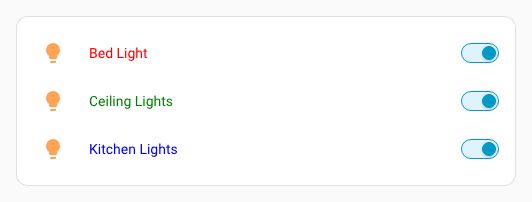
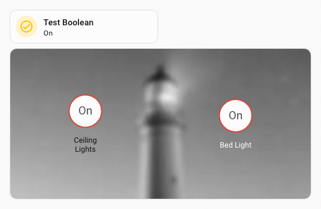
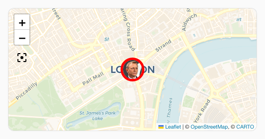

# Styliser les entités, badges, éléments et marqueurs d'entité

Dans les cartes `entities`, `glance` et `map`, [chaque entité peut avoir ses propres options](https://www.home-assistant.io/lovelace/entities/#options-for-entities). Pour styliser individuellement ces éléments, ajoutez un paramètre `uix` à la configuration de l'entité.

Dans ces cas, les styles sont injectés dans un `shadowRoot` ; l'élément le plus profond est donc ciblé avec `:host`.

Cela s'applique également aux badges de vue et aux éléments des cartes `picture-elements`.

```yaml
type: entities
entities:
  - entity: light.bed_light
    uix:
      style: |
        :host {
          color: red;
          }
  - entity: light.ceiling_lights
    uix:
      style: |
        :host {
          color: green;
        }
  - entity: light.kitchen_lights
    uix:
      style: |
        :host {
          color: blue;
        }
```



## Styliser les lignes conditionnelles des entités

Les lignes conditionnelles d'une carte Entities peuvent être stylisées directement. Si vous stylisez la configuration conditionnelle elle-même, soyez prudent : son conteneur n'est pas dans un `shadowRoot` et les styles peuvent déborder sur d'autres lignes ou éléments.

::: example Exemples de lignes conditionnelles
Styliser directement une ligne conditionnelle, uniquement la ligne de l'entité :
```yaml
type: entities
entities:
  - entity: light.ceiling_lights
  - type: conditional
    conditions:
      - condition: state
        entity: input_boolean.test_boolean
        state: 'on'
    row:
      entity: light.bed_light
      uix:
        style: |
          :host {
            color: red;
          }
```
Styliser la configuration d'une ligne conditionnelle en utilisant le `shadowRoot` (méthode réservée aux anciennes configurations) :
```yaml
type: entities
entities:
  - entity: light.ceiling_lights
  - type: conditional
    conditions:
      - condition: state
        entity: input_boolean.test_boolean
        state: "on"
    row:
      entity: light.bed_light
    uix:
      style:
        hui-toggle-entity-row $ hui-generic-entity-row $: |
          .row {
            color: red;
          }
```
Les deux exemples précédents produisent le résultat suivant :


Styliser une configuration conditionnelle dont les styles « débordent » sur toutes les lignes :
```yaml
type: entities
entities:
  - entity: light.ceiling_lights
  - type: conditional
    conditions:
      - condition: state
        entity: input_boolean.test_boolean
        state: "on"
    row:
      entity: light.bed_light
    uix:
      style: |
        :host {
          --primary-text-color: red;
        }
```


:::
## Styliser les éléments conditionnels de picture-elements

Les éléments d'une condition dans `picture-elements` peuvent être stylisés directement. Si vous stylisez la configuration conditionnelle elle-même, soyez prudent : son conteneur n'est pas dans un `shadowRoot` et les styles peuvent déborder sur d'autres lignes ou éléments.

::: example Exemple de condition dans picture-elements
Styliser directement un élément conditionnel, et lui seul :
```yaml
type: picture-elements
image:
  media_content_id: https://picsum.photos/id/870/200/100?grayscale&blur=2
elements:
  - type: state-badge
    entity: light.ceiling_lights
    style:
      left: 25%
      top: 50%
  - type: conditional
    conditions:
      - entity: input_boolean.test_boolean
        state: "on"
    elements:
      - type: state-badge
        entity: light.bed_light
        style:
          left: 75%
          top: 50%
        uix:
          style: |
            :host {
              color: white;
            }
```
Styliser la configuration conditionnelle (méthode réservée aux anciennes configurations) :
```yaml
type: picture-elements
image:
  media_content_id: https://picsum.photos/id/870/200/100?grayscale&blur=2
elements:
  - type: state-badge
    entity: light.ceiling_lights
    style:
      left: 25%
      top: 50%
  - type: conditional
    conditions:
      - entity: input_boolean.test_boolean
        state: "on"
    elements:
      - type: state-badge
        entity: light.bed_light
        style:
          left: 75%
          top: 50%
    uix:
      style:
        hui-state-badge-element $ ha-state-label-badge $: |
          :host {
            color: white;
          }
```
Les deux exemples précédents produisent le résultat suivant :



Styliser la configuration conditionnelle dont les styles « débordent » sur tous les éléments :
```yaml
type: picture-elements
    image:
      media_content_id: https://picsum.photos/id/870/200/100?grayscale&blur=2
    elements:
      - type: state-badge
        entity: light.ceiling_lights
        style:
          left: 25%
          top: 50%
      - type: conditional
        conditions:
          - entity: input_boolean.test_boolean
            state: "on"
        elements:
          - type: state-badge
            entity: light.bed_light
            style:
              left: 75%
              top: 50%
        uix:
          style: |
            :host {
              --primary-text-color: white;
            }
```


:::
## Styliser les marqueurs d'entité sur une carte

Les marqueurs d'entité d'une carte peuvent être stylisés individuellement dans la configuration de la carte ou dans un thème. Les deux exemples stylisent également l'image.

Style défini dans la configuration :

```yaml
  type: map
  entities:
    - entity: device_tracker.uix_test_person
      uix:
        style: |
          div.marker {
            border-color: red !important;
            border-width: 5px;
          }
  theme_mode: auto
```

Style défini dans le thème. Le sélecteur hôte `&` permet de cibler l'attribut `entity-id` de `ha-entity-marker`.

```yaml
  uix-entity-marker-yaml: |
    "&[entity-id='device_tracker.uix_test_person']": |
      :host {
        --uix-image: /local/media/person_grey.png
      }
      div.marker {
        border-color: red !important;
        border-width: 5px;
      }
```

Les deux exemples précédents produisent le résultat suivant :


