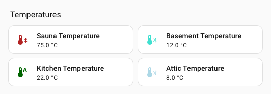

# Styliser les icônes

Une fois UI eXtension installé, vous pouvez définir par variables CSS l'icône et sa couleur pour les éléments `ha-state-icon`, `<ha-icon>` ou `<ha-svg-icon>`. Ils sont notamment utilisés par les cartes `tile`, `entities`, `glance` et `heading`. Définissez ces variables directement dans le style UIX de la carte ou dans un thème.

## Définir une surcharge pour une entité

Définissez des variables CSS sous la forme `--uix-icon-for-<entity_id>` et/ou `--uix-icon-color-for-<entity_id>`, en remplaçant chaque `.` de l'identifiant d'entité par `_`. Lors du rendu de l'icône, UIX remplace son symbole et/ou sa couleur par les valeurs fournies.

Les modèles sont pris en charge. Consultez l'[exemple complet de thème](#full-theme-example).

::: tip
- La variable peut être définie sur n'importe quel ancêtre dans le DOM. UIX la détecte sur l'élément grâce aux styles calculés. Si elle n'est pas définie ou si l'entité de l'élément ne correspond pas, l'icône d'origine est conservée.
- Pour les tableaux de bord Home Assistant, ajoutez `--uix-icon-for-<entity_id>` et/ou `--uix-icon-color-for-<entity_id>` aux variables de thème `uix-root(-yaml)` et `uix-more-info(-yaml)`.
- Pour les écrans de configuration et d'édition de l'interface, ajoutez ces variables aux variables de thème `uix-config(-yaml)` et `uix-dialog(-yaml)`.
- Pour les autres panneaux stylisables par UIX, ajoutez-les à la variable de thème appropriée. Par exemple, pour le panneau Historique, utilisez `uix-history(-yaml)`.

:::
## Définir une surcharge générique

Définissez les variables CSS génériques `--uix-icon` et/ou `--uix-icon-color` dans le contexte de l'icône à remplacer.

Lors du rendu de l'icône, UIX remplace son symbole et/ou sa couleur par les valeurs fournies.

Les modèles sont pris en charge.

::: tip
- Si `--uix-icon` et `--uix-icon-for-<entity_id>` sont tous deux définis, `--uix-icon` est prioritaire.
- Si `--uix-icon-color` et `--uix-icon-color-for-<entity_id>` sont tous deux définis, `--uix-icon-color` est prioritaire.
- Dans certains cas, vous devez définir l'icône dans la configuration de la carte pour pouvoir la remplacer, par exemple avec une carte `heading`. Sans icône configurée, UIX n'a aucune icône à remplacer.
- Soyez prudent avec les éléments qui affichent plusieurs icônes dans `:host`, par exemple une icône de tuile accompagnée d'un badge. Dans ce cas, appliquez `--uix-icon` à l'icône précise. Voir l'exemple.

:::
::: example Exemple de remplacement générique
```yaml
  - type: heading
    heading: House Temperatures
    heading_style: title
    icon: mdi:checkbox-blank-outline
    uix:
      style: |
        ha-icon {
          --uix-icon: {{ 'mdi:hvac' if is_state('climate.hvac', 'auto') else 'mdi:hvac-off' }};
          --uix-icon-color: {{ 'var(--state-climate-auto-color)' if is_state('climate.hvac', 'auto') else 'var(--state-inactive-color)' }};
        }
  - type: tile
    entity: sensor.sauna_temperature
    uix:
      style: |
        ha-tile-icon {
          --uix-icon: mdi:thermometer-bluetooth;
          --uix-icon-color:
          
           gray;
          
          
           dodgerblue
           lightblue
           turquoise
           green
           darkgreen
           orange
           crimson
           firebrick
          ;
          
        }
  - type: tile
    entity: sensor.basement_temperature
    uix:
      style: |
        ha-tile-icon {
          --uix-icon: mdi:thermometer-bluetooth;
          --uix-icon-color:
          
           gray;
          
          
           dodgerblue
           lightblue
           turquoise
           green
           darkgreen
           orange
           crimson
           firebrick
          ;
          
        }
  - type: tile
    entity: sensor.kitchen_temperature
    uix:
      style: |
        ha-tile-icon {
          --uix-icon: mdi:thermometer-bluetooth;
          --uix-icon-color:
          
           gray;
          
          
           dodgerblue
           lightblue
           turquoise
           green
           darkgreen
           orange
           crimson
           firebrick
          ;
          
        }
  - type: tile
    entity: sensor.attic_temperature
    uix:
      style: |
        ha-tile-icon {
          --uix-icon: mdi:thermometer-bluetooth;
          --uix-icon-color:
          
           gray;
          
          
           dodgerblue
           lightblue
           turquoise
           green
           darkgreen
           orange
           crimson
           firebrick
          ;
          
        }
  - type: tile
    entity: climate.hvac
    grid_options:
      columns: 12
      rows: 1
    uix:
      style: |
        ha-state-icon {
          --uix-icon: {{ 'mdi:hvac' if is_state('climate.hvac', 'auto') else 'mdi:hvac-off' }};
          --uix-icon-color: {{ 'var(--state-climate-auto-color)' if is_state('climate.hvac', 'auto') else 'var(--state-inactive-color)' }};
        }
```


:::
## Exemple complet de thème

Cet exemple définit deux macros dans un thème UIX et les utilise pour styliser les variables de thème `uix-root-yaml` et `uix-more-info-yaml`. Il n'utilise que le sélecteur racine `.:`, mais choisit les variantes `-yaml`, que vous avez peut-être déjà définies dans votre [thème](./themes.md).

Thème :

```yaml
uix-doc-icon-for-entity-theme:
  uix-theme: uix-doc-icon-for-entity-theme
  uix-macros-yaml: |
    temp_icon_color:
      params:
        - entity_id
      template: >
        
        --uix-icon-for-{{ entityString }}: mdi:thermometer-bluetooth;
        --uix-icon-color-for-{{ entityString }}:
        
         gray;
        
        
         dodgerblue
         lightblue
         turquoise
         green
         darkgreen
         orange
         crimson
         firebrick
        ;
        
    temp_icon_color_all:
      template: >
        
        
          {{ temp_icon_color(entity) }}
        

  uix-root-yaml: |
    .: |
      :host {
        {{ temp_icon_color_all() }}
      }

  uix-more-info-yaml: |
    .: |
      :host {
        {{ temp_icon_color_all() }}
      }
```

::: tip
`--uix-icon` et `--uix-icon-color` sont prioritaires sur `--uix-icon-for-<entity_id>` et `--uix-icon-color-for-<entity_id>`. Voir la tuile `sensor.kitchen_temperature` dans l'exemple.

:::
Cartes du tableau de bord (section) :

```yaml
type: grid
cards:
  - type: heading
    heading: Temperatures
    heading_style: title
  - type: tile
    entity: sensor.sauna_temperature
    icon: ''
    vertical: false
    features_position: bottom
  - type: tile
    entity: sensor.basement_temperature
  - type: tile
    entity: sensor.kitchen_temperature
    uix:
      style: |
        ha-tile-icon {
          
            --uix-icon: mdi:thermometer-auto;
          
        }
  - type: tile
    entity: sensor.attic_temperature
```


