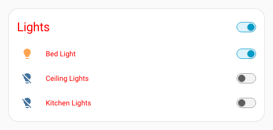
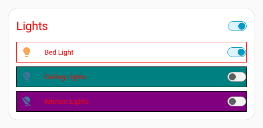
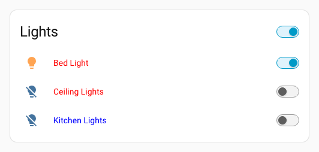
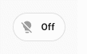

# Thèmes

## Premiers pas

Pour commencer, activez les thèmes dans Home Assistant.

La méthode recommandée consiste à créer un dossier `/config/themes/`, puis à ajouter les lignes suivantes à votre fichier `configuration.yaml` :

```yaml
frontend:
  themes: !include_dir_merge_named themes/
```

Après avoir redémarré Home Assistant, placez les fichiers de thème dans ce dossier et chargez-les avec le service Frontend [reload_theme](https://www.home-assistant.io/integrations/frontend/#setting-themes).

Les fichiers de thème sont généralement des documents YAML contenant les paramètres des nombreuses variables personnalisables de Home Assistant.

`/config/themes/red.yaml`

```yaml
red-theme:
  primary-color: red
  ha-card-border-radius: 20px
```

::: tip Theme name
Le nom du thème doit figurer sur la première ligne ; le reste doit être indenté d'un niveau.

:::
{ width="500" }

## Thème UIX de base

::: info Theme variable
Le thème DOIT définir une variable `uix-theme` dont la valeur désigne la configuration de thème utilisée par UIX pour ses styles et ses macros. En général, `uix-theme` correspond au nom du thème Home Assistant, mais peut désigner un autre thème si vous souhaitez réutiliser sa configuration UIX.

`uix-theme` correspondant au thème Home Assistant :

```yaml
my-awesome-theme:
  uix-theme: my-awesome-theme

  ... UIX theme variables, styles, macros go here ...
```

`uix-theme` désignant un autre thème :

```yaml
theme-mods:
  ... UIX theme variables, styles, macros go here ...

my-awesome-theme:
  uix-theme: theme-mods
```

:::
`/config/themes/red.yaml`

```yaml
red-theme:
  uix-theme: red-theme # this variable must match a valid Home Assistant theme name including case

  primary-color: red
  primary-text-color: white
  ha-card-border-radius: 20
```

Une fois `uix-theme` défini, vous pouvez utiliser les fonctionnalités avancées de UIX.

Pour appliquer globalement les fonctions de base de UIX, utilisez les variables `uix-<thing>`, où `<thing>` correspond à n'importe quelle [variable de thème](#theme-variables).

Par exemple, pour ajouter une bordure autour de chaque ligne d'une carte Entités, vous pouvez procéder ainsi :

```yaml
type: entities
entities:
  - entity: light.bed_light
    style: |
      :host {
        display: block;
        border: 1px solid black;
      }
  - entity: light.ceiling_lights
    uix:
      style: |
        :host {
          display: block;
          border: 1px solid black;
        }
  - entity: light.kitchen_lights
    uix:
      style: |
        :host {
          display: block;
          border: 1px solid black;
        }
```

Vous pouvez maintenant déplacer cette règle dans le thème :

```yaml
red-theme:
  uix-theme: red-theme
  ...
  uix-row: |
    :host {
      display: block;
      border: 1px solid black;
    }
```

{ width="500" }

::: tip `uix-<thing>` variables
`uix-<thing>` variables contain strings containing CSS code, and must start with `|` or `>` and be indented at least one step.

:::
Comme pour les styles habituels, vous pouvez utiliser les modèles Jinja2 pour traiter les règles.

```yaml
red-theme:
  uix-theme: red-theme
  ...
  uix-row: |
    :host {
      display: block;
      border: 1px solid  red  black ;
    }
```

{ width="500" }

## Classes

UIX lets you set a CSS class to elements. You can then use this in your theme.

```yaml
red-theme:
  uix-theme: red-theme
  ...
  uix-row: |
    ...
    :host(.teal) {
      background: teal;
    }
    :host(.purple) {
      background: purple;
    }
```

```yaml
type: entities
entities:
  - entity: light.bed_light
  - entity: light.ceiling_lights
    uix:
      class: teal
  - entity: light.kitchen_lights
    uix:
      class: purple
```

{ width="500" }

## Naviguer dans le DOM shadow

Comme pour les styles UIX appliqués à une carte, vous pouvez parcourir la structure DOM fantôme de l'élément à styliser. Pour cela, indiquez la variable `uix-<thing>-yaml` ; la syntaxe reste identique.

```yaml
red-theme:
  uix-theme: red-theme
  ...
  uix-row-yaml: |
    ...
    hui-generic-entity-row $ state-badge $: |
      @keyframes pulse {
        50% {
          opacity: 0.5;
        }
      }
      ha-state-icon {
        animation: pulse 2s infinite;
      }
```

::: tip Theme variables MUST be strings
Bien que la valeur de `uix-<thing>-yaml` soit du YAML, elle DOIT être une chaîne du point de vue du thème, contenant elle-même d'autres chaînes.

:::
## Surcharge locale de thème avec `uix.theme` { #local-theme-override-with-uixtheme }

Vous pouvez imposer à une carte, une ligne, un badge ou un élément stylisé un thème Home Assistant différent du thème global actif. Pour ce nœud UIX, `uix.theme` est prioritaire sur le thème hérité ou actif.

Thème principal de ligne rouge :

```yaml
row-red:
  uix-theme: row-red
  uix-row-yaml: |
    hui-generic-entity-row $: |
      .info{
        color: red;
      }

```

Thème de remplacement de ligne bleue :

```yaml
row-blue-override:
  uix-theme: row-blue-override
  uix-row-yaml: |
    hui-generic-entity-row $: |
      .info{
        color: blue;
      }
```

Carte Entités avec un thème de remplacement pour une ligne :

```yaml
type: entities
title: Lights
entities:
  - entity: light.bed_light
  - entity: light.ceiling_lights
  - entity: light.kitchen_lights
    uix:
      theme: row-blue-override
```

{ width="500" }

::: warning Take caution where you use theme overrides
La personnalisation des styles et des thèmes dans Home Assistant peut devenir complexe. Une variable CSS peut ne pas s'appliquer comme prévu. Par exemple, si vous définissez `--primary-text-color: color;` sur une ligne Entités avec un style UIX direct sur `:host {}` ou avec `uix.theme`, vous pourriez vous attendre à ce que le texte prenne cette couleur. Toutefois, dans ce cas, la propriété `color` est définie sur l'élément `ha-card` de la carte Entités ; le remplacement n'aura donc aucun effet.

:::
## Mettre à jour une variable `uix-<thing>` vers `uix-<thing>-yaml`

::: tip UIX theme variable precedence
`uix-<thing>-yaml` always takes precedence over `uix-<thing>` which is NOT used if `uix-<thing>-yaml` is present in the theme.

:::
En développant vos thèmes UIX, vous pourriez commencer avec des chaînes CSS simples dans `uix-<thing>`, puis avoir besoin de passer à `uix-<thing>-yaml`. Utilisez alors le sélecteur YAML racine `.:`. Voici l'exemple complet du thème rouge avec `uix-row-yaml`.

```yaml
red-theme:
  uix-theme: red-theme # this variable must match a valid Home Assistant theme name including case

  primary-color: red
  ha-card-border-radius: 20px

  uix-row-yaml: |
    .: |
      :host {
        display: block;
        border: 1px solid  red  black ;
      }
      :host(.teal) {
        background: teal;
      }
      :host(.purple) {
        background: purple;
      }
    hui-generic-entity-row $ state-badge $: |
      @keyframes pulse {
        50% {
          opacity: 0.5;
        }
      }
      ha-state-icon {
        animation: pulse 2s infinite;
      }
```

## Variables de thème

- `uix-card`
- `uix-row`
- `uix-glance`
- `uix-badge`
- `uix-heading-badge`
- `uix-assist-chip`
- `uix-element`
- `uix-entity-marker`
- `uix-root`
- `uix-view`
- `uix-more-info`
- `uix-sidebar`
- `uix-config`
- `uix-panel-custom`
- `uix-top-app-bar-fixed`
- `uix-dialog`
- `uix-toast`
- `uix-grid-section`
- `uix-calendar`
- `uix-todo`
- `uix-history`
- `uix-states-history-charts`
- `uix-drawer`
- `uix-view-background`
- `uix-persistent-notification-item`

Aussi `<any variable>-yaml`.

## Boîtes de dialogue

`uix-dialog` and `uix-dialog-yaml` apply to styles rooted in the dialog element of dialogs which may be `ha-dialog`, `ha-adaptive-dialog`, or `ha-drawer` (notification uses a dialog with an element using the drawer type). Dialogs will also have their class set to `type-<dialog-type>` where `<dialog-type>` will be the dialog element name with any `ha-` prefix stripped. e.g. UIX will append `type-dialog-box` to dialog boxes as used by alerts and other dialog boxes. The Home Assistant dialog manager places dialogs in the shadow root of the top `<home-assistant>` element. The active dialog will be the last child of the shadow root. To view what dialog you wish to target, review the last child of this shadow root node.

Consultez le guide UIX [Styliser les boîtes de dialogue avec UI eXtension](https://uix-guides.lf.technology/dialogs/2026/02/27/styling-dialogs.html).

## Macros

Les thèmes peuvent définir des macros Jinja2 réutilisables par toutes les cartes qui les utilisent. Les macros sont déclarées sous la clé de thème `uix-macros-yaml`, sous forme de dictionnaire YAML de définitions. Consultez [Modèles - Macros](templates.md#macros) pour la référence complète de configuration.

```yaml
my-awesome-theme:
  uix-theme: my-awesome-theme

  uix-macros-yaml: |
    is_on:
      params:
        - entity_id
      returns: true
      template: ""
    badge_color:
      params:
        - entity_id
        - name: color_on
          default: "'var(--state-active-color)'"
        - name: color_off
          default: "'var(--state-inactive-color)'"
      template: "{{ color_on if is_on(entity_id) else color_off }}"
```

Exemple de badge utilisant les valeurs par défaut de la macro de thème `badge_color()` :

```yaml
  badges:
    - type: entity
      entity: light.bed_light
      tap_action:
        action: toggle
      uix:
        style: |
          ha-badge {
            --badge-color: {{ badge_color(config.entity) }} !important;
          }
```


Exemple de badge définissant la variable nommée `color_on` sur `red` dans la macro de thème `badge_color()` :

```yaml
  badges:
    - type: entity
      entity: light.bed_light
      tap_action:
        action: toggle
      uix:
        style: |
          ha-badge {
            --badge-color: {{ badge_color(config.entity, color_on='red') }} !important;
          }
```



Les macros `uix.macros` définies sur une carte sont prioritaires sur celles du thème portant le même nom.

::: warning
[Theme macros](#macros) are only available in UIX styling templates, not in UIX Forge element/forge templates.
Utilisez les [fonderies globales](../forge/foundries.md#global-foundries) de UIX Forge pour définir des `forge.macros` disponibles globalement ou pour un `mold`.
:::
