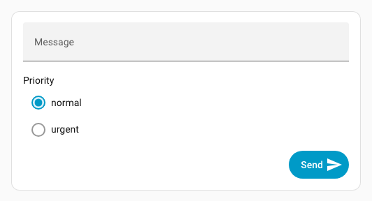

# Form Spark

Der Spark `form` bettet Home Assistants `<ha-form>` in ein Forge-Element ein. Sein `schema` entspricht dem Home-Assistant-Formularschema: Jedes Feld erhält einen eindeutigen `name`, optional `label` und `default` sowie einen Home-Assistant-`selector`.

Die optionalen Schaltflächen `submit` und `clear` führen Home-Assistant-Aktionen aus. Aktuelle Formularwerte werden in deren `data` übernommen und haben bei gleichen Schlüsseln Vorrang vor statischen Aktionsdaten. Die Schaltflächen können entfallen: In einer [Popover-Aktion](../../extras/uix-actions#popover) werden Formularwerte automatisch an `tap_action`, `hold_action` oder `double_tap_action` beider Fußzeilen-Schaltflächen übergeben.

## Grundlegende Verwendung

Eine leere Forge-Karte benötigt keinen Platzierungsselektor; das Formular wird automatisch in ihren Inhalt eingefügt.

```yaml
type: custom:uix-forge
forge:
  mold: card
  sparks:
    - type: form
      density: dense
      schema:
        - name: message
          label: Message
          selector:
            text: {}
        - name: priority
          label: Priority
          default: normal
          selector:
            select:
              options:
                - normal
                - urgent
      submit:
        text: Send
        icon: mdi:send
        icon_position: end
        action:
          action: perform-action
          perform_action: script.send_message
```



Die Aktion erhält `data.message` und `data.priority`, im Skript verfügbar als `{{ message }}` und `{{ priority }}`. Standardmäßig leert Absenden das Formular, nachdem eine gültige Aktion ausgelöst wurde.

## Werte an UIX Actions übergeben

### Event-Aktion

Bei `action: event` ergänzen die Formularwerte das `detail` des benutzerdefinierten Events. Statische `data` bleiben erhalten; gleichnamige Formularfelder haben Vorrang. Das Beispiel sendet `uix-form-submitted` auf `window` mit `source`, `message` und `priority`. Ein Formularfeld `source` würde `contact-form` ersetzen.

```yaml
submit:
  action:
    action: fire-dom-event
    uix:
      action: event
      name: uix-form-submitted
      data:
        source: contact-form
```

### JavaScript-Aktion

Bei `action: javascript` ergänzen die Formularwerte `variables` und stehen als `variables.<Feldname>` zur Verfügung. Statische Variablen bleiben erhalten, gleichnamige Formularfelder haben Vorrang; auch hier würde ein Feld `source` den Wert `contact-form` ersetzen.

```yaml
submit:
  action:
    action: fire-dom-event
    uix:
      action: javascript
      data:
        variables:
          source: contact-form
        code: >
          console.info(`Submitted: Message: ${variables.message},
          Priority: ${variables.priority} from ${variables.source}`);

```

## Platzierung in Markdown-Karten

In einer Forge-Markdown-Karte wird das Formular automatisch nach dem Markdown-Inhalt eingefügt. Die entsprechende ausdrückliche Platzierung lautet:

```yaml
after: hui-markdown-card $ ha-markdown
```

Mit `before` lässt es sich vor dem Inhalt platzieren:

```yaml
type: custom:uix-forge
forge:
  mold: card
  sparks:
    - type: form
      before: hui-markdown-card $ ha-markdown
      schema:
        - name: note
          selector:
            text:
              multiline: true
      submit:
        action:
          action: perform-action
          perform_action: script.save_note
element:
  type: markdown
  content: "## Add a note"
```


## Konfiguration

| Schlüssel | Typ | Erforderlich | Standard | Beschreibung |
| --- | --- | --- | --- | --- |
| `type` | string | Ja | — | Muss `form` sein. |
| `schema` | list | Ja | — | `ha-form`-Schema; Selektorfelder enthalten gewöhnlich `name`, optional `label` und `default` sowie `selector`. |
| `after` | string | Nein | siehe Platzierung | UIX-Selektor des Referenzelements; fügt das Formular als Geschwisterelement dahinter ein. |
| `before` | string | Nein | — | Fügt das Formular als Geschwisterelement davor ein. |
| `for` | string | Nein | siehe Platzierung | Alias für `after`. |
| `density` | `spacious`, `reduced`, `dense` | Nein | `spacious` | Vertikaler Feldabstand, siehe [Dichte](#dichte). |
| `submit` | object | Nein | — | Absende-Schaltfläche. |
| `clear` | object oder `true` | Nein | — | Leeren-Schaltfläche; `true` verwendet die Standardkonfiguration. |

Ohne `after`, `before` und `for` verwendet eine leere Forge-Karte `uix-forge-blank-card $ div.content`, eine Markdown-Karte `hui-markdown-card $ ha-markdown`. Andere Forge-Elementtypen benötigen einen ausdrücklichen Platzierungsselektor.

### `submit`

| Schlüssel | Typ | Standard | Beschreibung |
| --- | --- | --- | --- |
| `action` | action object | — | Home-Assistant-Aktion mit den aktuellen Formulardaten. |
| `text` | string | `Submit` | Schaltflächentext. |
| `icon` | string | — | Optionales MDI-Icon. |
| `icon_position` | `start`, `end` | `start` | Slot des Icons im `ha-button`. |
| `variant` | string | `brand` | `brand`, `neutral`, `danger`, `warning` oder `success`. |
| `appearance` | string | `accent` | `accent`, `filled`, `outlined` oder `plain`. |
| `clear` | boolean | `true` | Alle Eingaben nach dem Auslösen einer gültigen Absende-Aktion leeren. |

### `clear`

| Schlüssel | Typ | Standard | Beschreibung |
| --- | --- | --- | --- |
| `action` | action object | — | Optionale Aktion mit aktuellen Formulardaten vor dem Leeren. |
| `text` | string | `Clear` | Schaltflächentext. |
| `icon` | string | — | Optionales MDI-Icon. |
| `icon_position` | `start`, `end` | `start` | Slot des Icons im `ha-button`. |
| `variant` | string | `neutral` | `brand`, `neutral`, `danger`, `warning` oder `success`. |
| `appearance` | string | `filled` | `accent`, `filled`, `outlined` oder `plain`. |

Die Leeren-Schaltfläche leert die Eingaben immer, auch ohne eigene Aktion. Schema-Standardwerte gelten beim ersten Anzeigen; nach dem Leeren sind die Felder leer. `clear: true` erzeugt die unkonfigurierte Standard-Schaltfläche.

## Dichte

`density` bestimmt den vertikalen Abstand zwischen Feldern in `ha-form` und verkleinert bei Listen-Selektoren die vertikalen Ränder der Radio-Steuerelemente. Andere Selektoren behalten ihre üblichen Home-Assistant-Klickflächen.

| Wert | Feldabstand | Verwendung |
| --- | --- | --- |
| `spacious` | `24px` | Standardlayout von Home Assistant. |
| `reduced` | `16px` | Kompakte Karten mit wenigen Feldern. |
| `dense` | `8px` | Popover oder Karten mit wenig Platz. |

```yaml
- type: form
  density: dense
  schema:
    - name: note
      selector:
        text: {}
```

## Formular und Steuerelemente gestalten

CSS-Variablen am Forge-Host werden durch die offenen Shadow-DOM-Grenzen von `ha-form` und seinen Selektoren vererbt. Setze sie mit `forge.uix.style` und `:host`.

```yaml
type: custom:uix-forge
forge:
  mold: card
  uix:
    style: |
      :host {
        /* UIX form layout */
        --uix-form-padding: var(--ha-space-3);
        --uix-form-field-gap: var(--ha-space-2);

        /* Home Assistant ha-input controls used by text selectors */
        --ha-input-padding-bottom: var(--ha-space-1);
        --ha-input-text-align: start;
      }
  sparks:
    - type: form
      density: reduced
      schema:
        - name: note
          selector:
            text: {}
```

`density` verändert den Abstand **zwischen** Feldern und die vertikalen Ränder von Radio-Steuerelementen in Listen-Selektoren: `reduced` verwendet oben und unten 8 px, `dense` 4 px. Home-Assistant-Variablen können zusätzlich die Steuerelemente selbst anpassen, etwa `--ha-input-padding-bottom` für Text- und Zahlenselektoren mit `ha-input`.

Home Assistant behält die 56-px-Klickfläche von Textfeldern, Schaltern und normalen Boolean-Feldern. Dafür gibt es derzeit keinen gemeinsamen öffentlichen Höhen-Token; `density` verkleinert diese Fläche daher nicht.

### Verfügbare Tokens

| Variable | Standard | Beschreibung |
| --- | --- | --- |
| `--uix-form-padding` | `var(--ha-space-4, 16px)` | Innenabstand des Formulars. |
| `--uix-form-actions-gap` | `var(--ha-space-2, 8px)` | Abstand zwischen Leeren und Absenden. |
| `--uix-form-actions-margin-top` | `var(--ha-space-4, 16px)` | Abstand über der Schaltflächenzeile. |
| `--uix-form-field-gap` | abhängig von `density` | Vertikalen Feldabstand überschreiben. |
| `--uix-form-radio-option-control-margin` | abhängig von `density` | Radio-Ränder bei `reduced` und `dense`; gleiche Vier-Werte-Reihenfolge wie CSS `margin`. |
| `--ha-radio-option-control-margin` | Home-Assistant-Standard | Radio-Ränder direkt setzen, etwa bei `spacious` oder einzelnen Steuerelementen. |
| `--ha-radio-option-toggle-size` | `20px` | Radio-Durchmesser; verändert nicht die Klickfläche der Zeile. |
| `--ha-checkbox-size` | `20px` | Checkbox-Größe; verändert nicht die Klickfläche der Zeile. |
| `--ha-input-padding-top` | nicht gesetzt | Oberer Innenabstand eines `ha-input`. |
| `--ha-input-padding-bottom` | `var(--ha-space-2)` | Unterer Innenabstand eines `ha-input`. |
| `--ha-input-text-align` | `start` | Textausrichtung eines `ha-input`. |
| `--ha-input-required-marker` | `"*"` | Pflichtfeldmarkierung von `ha-input`. |

Auch `--ha-space-*`, `--ha-font-size-*`, `--primary-color` und `--ha-color-*` können in derselben `:host`-Regel verwendet werden. Selektortypen verwenden unterschiedliche Steuerelemente; nicht jeder Token gilt für jedes Feld.

### Selektorspezifische Tokens finden

Untersuche das gerenderte Feld in den Browser-Entwicklerwerkzeugen und prüfe die dokumentierten CSS-Eigenschaften und Parts seiner Komponente. Referenzen im Home-Assistant-Frontend:

- [`ha-form`](https://github.com/home-assistant/frontend/blob/dev/src/components/ha-form/ha-form.ts): Feldlayout.
- [`ha-selector`](https://github.com/home-assistant/frontend/blob/dev/src/components/ha-selector/ha-selector.ts): Auswahl des konkreten Steuerelements.
- [`ha-input`](https://github.com/home-assistant/frontend/blob/dev/src/components/input/ha-input.ts): Eigenschaften für Text- und Zahlenselektoren, einschließlich Innenabstand und Textausrichtung.

## Popover-Beispiel

Die UIX-Aktion `popover` enthält das Forge-Element mit Form-Spark. Ihre Fußzeilen-Schaltfläche ruft eine UIX-`javascript`-Aktion auf; die Formularfelder werden automatisch in deren `variables` übernommen.

```yaml
type: button
name: Popover
show_icon: false
tap_action:
  action: fire-dom-event
  uix:
    action: popover
    data:
      buttons:
        primary:
          label: Send
          end_icon: mdi:send
          tap_action:
            action: fire-dom-event
            uix:
              action: javascript
              data:
                variables:
                  source: contact-form
                code: >
                  console.info(`Submitted: Message: ${variables.message},
                  Priority: ${variables.priority} from ${variables.source}`);
      uix:
        style: |
          .uix-popover-card {
            --ha-card-border-width: 0px;
            --ha-card-background: none;
            --uix-form-padding: 0px;
            --ha-radio-option-active-color: red;
          }
      card:
        type: custom:uix-forge
        forge:
          mold: card
          sparks:
            - type: form
              density: dense
              schema:
                - name: message
                  label: Message
                  selector:
                    text: {}
                - name: priority
                  label: Priority
                  default: normal
                  selector:
                    select:
                      options:
                        - normal
                        - urgent
```


Bei Nachricht `Hello Jim` und Priorität `urgent` lautet die Ausgabe:

```console
Submitted: Message: Hello Jim, Priority: urgent from contact-form
```

Quelle: [kanonische englische Form-Spark-Dokumentation](https://uix.lf.technology/forge/sparks/form/), abgeglichen mit Revision `c70d1275f1fb`.
